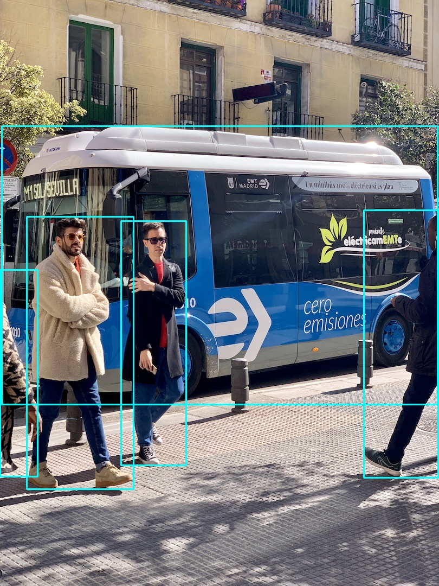

# yolov5-onnxruntime

C++ YOLO v5 ONNXRuntime inference code. `Work in progress`...

Dependecies: OpenCV 4.5.2, ONNXRuntime 1.8.1. (Tested only on Windows 10).

To run the executable you have to add OpenCV and ONNXRuntime DLL's to your environment path or put all needed DLL's near the executable.

Run from CLI:
```bash
# yolov5_ort.exe path_to_onnx_model path_to_class_names path_to_image
yolov5_ort.exe yolov5m.onnx coco.names bus.jpg
```

<p align="center">
  <a href="images/bus_result.jpg"></a>
</p>


## TODO
- refactoring;
- add C++ letterbox implementation and scaling;
- read class names from file;
- better visualization with class names and boxes;
- create YOLO class for easy deployment; 
- add Python implementation of the project.

## References
- YOLO v5 repo: https://github.com/ultralytics/yolov5
- YOLOv5 Runtime Stack repo: https://github.com/zhiqwang/yolov5-rt-stack
