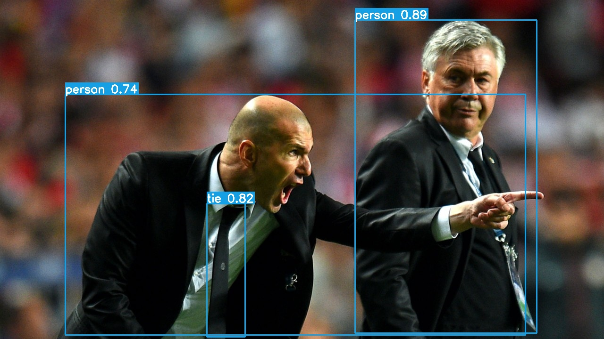

# yolov5-onnxruntime

C++ YOLO v5 ONNX Runtime inference code. `Work in progress...`

Dependecies: CMake 3.16, OpenCV 4.5.2, ONNXRuntime 1.8.1. (Tested on Windows 10 and Ubuntu 20.04).

## Build
To build the project you should run the following commands, don't forget to change `ONNXRUNTIME_DIR` cmake option:

```bash
mkdir build
cd build
cmake -DONNXRUNTIME_DIR=path_to_onnxruntime ..
cmake --build .
```

## Run
Before running the executable you should convert you PyTorch model to ONNX if you haven't done it yet. Check the official tutorial on it here: https://github.com/ultralytics/yolov5/issues/251

To run the executable you should add OpenCV and ONNX Runtime libraries to your environment path `or` put all needed libraries near the executable.

Run from CLI:
```bash
# On Linux
# ./yolov5_ort path_to_onnx_model path_to_class_names path_to_image
./yolov5_ort ../models/yolov5m.onnx ../models/coco.names ../images/bus.jpg

# On Windows
yolov5_ort.exe ../models/yolov5m.onnx ../models/coco.names ../images/bus.jpg
```

## Demo

<p align="center">
  <a href="images/bus_result.jpg"></a>
</p>
<p align="center">
  <a href="images/zidane_result.jpg"></a>
</p>


## TODO
- add C++ letterbox implementation and scaling;
- add device selection for inference;
- add Python implementation of the project.
- refactoring;
- ~~add Linux compatibility~~;
- ~~read class names from file~~;
- ~~better visualization with class names and boxes~~;
- ~~create YOLO class for easy deployment~~; 

## References
- YOLO v5 repo: https://github.com/ultralytics/yolov5
- YOLOv5 Runtime Stack repo: https://github.com/zhiqwang/yolov5-rt-stack
- ONNXRuntime Inference examples: https://github.com/microsoft/onnxruntime-inference-examples
